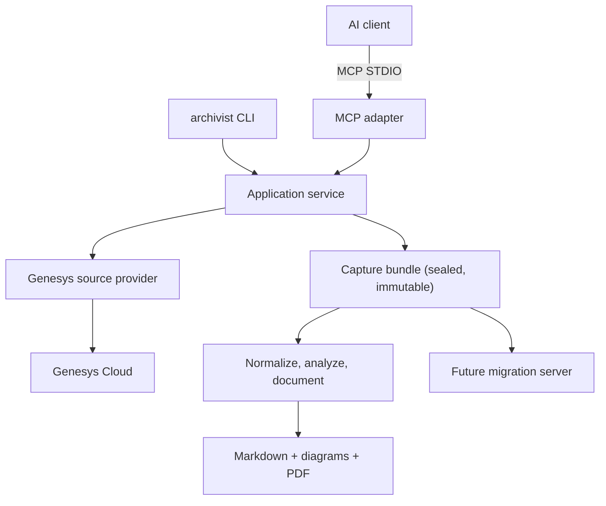

# Genesys Archivist

Captures Genesys Cloud Architect flows and every resource they depend on, then generates business and technical documentation from that capture.

Two consumers, two guarantees:

| Consumer                                       | Gets                                          | Guarantee                                                                          |
| ---------------------------------------------- | --------------------------------------------- | ---------------------------------------------------------------------------------- |
| Humans — engineers, PMs, customers             | Markdown, PDF, and diagrams per flow          | Every technical fact traces to source evidence; inference is labelled as inference |
| Machines — a future, separate migration server | An immutable, schema-versioned capture bundle | Complete enough to rebuild the IVR on another platform, including prompt audio     |

Archivist does not build that migration server. It guarantees the data contract that server will consume.

## Status

**Both stages work end to end against a real Genesys organization.** ~1,166 tests, with format, lint, production and test typechecking, and schema validation in `npm run verify`.

Plans 1–5 are built. Every `archivist` command is wired: `profile`, `doctor`, `capture`, `document`, `verify`. The MCP server exposes nine tools, eight of them backed by real implementations. The source path was settled by measurement rather than assumption — the Platform API configuration endpoint ([ADR-015](docs/adr/README.md)) — and the adapter reaches it over a transport that exposes only `GET`, so read-only is a property of the type rather than a matter of reviewer attention ([ADR-019](docs/adr/ADR-019-http-transport.md)).

Measured against the pilot sandbox: **511 flows across 15 types, 401 published**. A whole-organization `context` capture is about 400 requests, **~95 seconds**, ~10 MB ([S6](docs/spikes/S6-scale-budgets.md)).

### The permission gate is closed

S4 passes. A dedicated read-only role took the capture credential from 783
permission policies with 580 mutating grants down to **16 policies with zero
mutation, caller-data, or credential permissions** — while keeping every
endpoint the adapter calls reachable. Details, and the four things the exercise
found that reading could not, are in [S4](docs/spikes/S4-permission-matrix.md).

### Known gaps

- **Migration mode holds every asset in memory at once** — ~110 MB on the sandbox, unbounded in organization size. Do not run it against a large real organization yet; `context` mode is unaffected. Three ranked fixes are in [Plan 5](docs/superpowers/plans/2026-08-20-05-production-adapter-and-server.md).
- `genesys_flow_diff` still returns an explicit rejection rather than a result.
- Change detection exists as a pure decision function, but its I/O is unwired, so every run reprocesses every flow.
- One test file flakes roughly 1 run in 6 on Windows, documented in its own header.

## Two capture modes

Per [ADR-018](docs/adr/ADR-018-capture-modes.md), capture has two jobs and they are named separately:

```text
archivist capture --mode context   --org <id> [--flow <id>...]
archivist capture --mode migration --org <id> [--flow <id>...]
```

**`context`** captures flow definitions and the resource manifest that arrives with them, so a developer returning to an unfamiliar IVR can re-orient quickly. It does not walk resources to closure or download assets, which makes it fast enough to run across a whole organization routinely.

**`migration`** captures everything needed to rebuild the IVRs elsewhere: every resource body, every byte of prompt audio, data-table rows.

Both produce a bundle. A `context` bundle records `policy.mode: "context"`, reports `migrationReadiness.archyImportableYaml: false`, and carries a caveat saying so in words — it can never be mistaken for a migration-ready one.

## The architecture in one paragraph

Two stages separated by a hard seam. **Stage 1 (capture)** is the only code that talks to Genesys: it discovers every flow of every type, fetches definitions, walks the resource reference graph to closure, downloads binary assets, and seals an immutable content-hashed **capture bundle**. **Stage 2 (document)** opens no sockets — it reads a bundle and produces Markdown, SVG diagrams, and PDF, with AI narration in the middle. Re-rendering documentation therefore costs zero Genesys API calls, and the bundle is a published contract rather than a disposable cache.



## Getting started

```bash
npm install
npm run verify        # format + lint + typecheck + test + schema validation
npm run build
```

### Point it at an organization

A profile holds the non-secret metadata and names the credential. **The client
secret is read from stdin or a hidden prompt, never from a flag** — argv is
visible in process listings and shell history, so `--client-secret` is refused
with an explanation rather than accepted.

```bash
archivist profile add \
  --id acme --display-name "Acme Bank" \
  --region euw1 --org <organizationId> \
  --client-id <oauthClientId> \
  --output-root /path/to/output
# then paste the secret at the prompt, or:  echo "$SECRET" | archivist profile add ...

archivist doctor                 # Node version, credential store, profiles
archivist profile validate acme  # profile parses, secret present, root writable
```

### Capture and document

```bash
# Fast, whole-organization. Definitions plus the resource manifest that
# already travels with them. Cannot be migrated — see ADR-018.
archivist capture --profile acme --mode context --org <organizationId>

# Everything needed to rebuild elsewhere: resource bodies, prompt audio,
# data-table rows. See the memory caveat above before running this at scale.
archivist capture --profile acme --mode migration --org <organizationId> --flow <flowId>

archivist verify   --bundle <bundleDir>    # content hashes still match
archivist document --bundle <bundleDir>    # business.md, technical.md, operations.md, diagrams
```

`--profile` is required for `capture`, and not merely for convenience: the
profile supplies the approved output root and the `expectedOrganizationId` that
guards against a mistyped credential capturing the wrong customer's
configuration.

### Drive it from an AI client

```json
{
  "mcpServers": {
    "genesys-archivist": { "command": "genesys-archivist-mcp" }
  }
}
```

STDIO only. The server writes protocol messages to stdout and everything else
to stderr, opens no network listener, and **exposes no tool that accepts a
credential** — a test walks every registered tool's input schema and fails if
any property name is credential-shaped at any depth. Provisioning is CLI-only,
forever.

Then read, in order:

1. **[CLAUDE.md](CLAUDE.md)** — orientation for anyone (human or agent) about to write code here.
2. **[AGENTS.md](AGENTS.md)** — non-negotiable boundaries. Violating one is a release blocker.
3. **[The design spec](docs/superpowers/specs/2026-08-20-genesys-archivist-design.md)** — what is being built and why. Section 2 lists where it departs from the numbered blueprint docs below.
4. **[Plan 1: Foundation](docs/superpowers/plans/2026-08-20-01-foundation.md)** — twelve task-by-task TDD tasks that need no Genesys access.
5. **[Phase 0 spikes](docs/spikes/README.md)** — the go/no-go gate that unblocks everything else.

## Phase 0 was a go/no-go gate, and it passed

Four source paths were in contention — Platform API, the Archy CLI, the Architect Scripting SDK, and manual YAML. Which one won was an empirical result, not an assumption.

Spike S1 measured the Platform API configuration endpoint at 100% structural fidelity against a manually exported Architect YAML baseline: 47 nodes, 10 construct types, zero unexplained differences. It additionally supplies a stable `trackingId` on every node and a manifest of referenced resources with ids and per-node provenance. The Architect Scripting SDK was dropped entirely ([ADR-015](docs/adr/README.md)); it would have supplied a strict subset at a much higher dependency cost.

The permission-matrix spike has since run and **failed** — see [S4](docs/spikes/S4-permission-matrix.md) and the Status section above. Prompt audio downloads read-only, clearing kill criterion 11 ([S5](docs/spikes/S5-prompt-audio.md)), and scale budgets are measured ([S6](docs/spikes/S6-scale-budgets.md)). Note that two spike-numbering schemes disagree from S3 onward; cite spikes by filename, not number.

## Repository layout

```text
apps/cli               archivist CLI
apps/mcp-server        genesys-archivist MCP STDIO server
packages/domain        contracts and DTOs. Pure: no I/O, no SDK types
packages/application   use cases, run state machines, policy
packages/composition   the one place adapters are wired to interfaces
packages/...           adapters, capture, analysis, documentation, rendering, narrative
schemas/               versioned JSON Schema contracts
fixtures/              sanitized test fixtures. Never real customer configuration
docs/                  blueprint, design spec, plans, ADRs, spikes
```

Dependency direction is enforced by ESLint, not by convention: `domain` imports nothing, `application` imports `domain` only, and `apps/*` stay thin.

## Never commit

`bundles/`, `derived/`, `documentation/`, `spike-evidence/`, or any `.wav` / `.mp3`. Capture bundles are classified `restricted` — they contain endpoint URLs, DIDs, routing logic, data-table rows that may hold customer PII, and prompt audio. CI fails the build if any of these are tracked.

## Terminology

The target is **Genesys Cloud CX**, and the IVR authoring product is **Architect**.

A flow has identifiers such as `flowId` and a version. Queues, prompts, data actions, schedules, and reusable flows also have identifiers. **These are not secret API keys.** A Genesys OAuth `client_id` and `client_secret` authenticate the integration and are the only secrets involved. The tool never enumerates hidden secrets, recovers OAuth client secrets, scrapes passwords, or bypasses Genesys permissions.

## Non-goals for the first production release

- Editing, publishing, deleting, or importing Genesys flows
- Recovering or listing customer secrets
- Reading live caller data, recordings, transcripts, or historical execution data
- Query or Q&A tools over captured data
- Remote HTTP hosting, git/PR automation, or a scheduling daemon
- Claiming business intent that cannot be inferred from configuration

## Blueprint documents

The original handoff. Still governing wherever the design spec does not override it.

| File                                                                          | Purpose                                            |
| ----------------------------------------------------------------------------- | -------------------------------------------------- |
| [00-product-brief.md](docs/00-product-brief.md)                               | Product goals, users, assumptions, scope           |
| [01-system-architecture.md](docs/01-system-architecture.md)                   | Components, packages, runtime decisions            |
| [02-genesys-integration.md](docs/02-genesys-integration.md)                   | Authentication, discovery, extraction, versions    |
| [03-mcp-contract.md](docs/03-mcp-contract.md)                                 | MCP tools, resources, prompts, errors, jobs        |
| [04-domain-model.md](docs/04-domain-model.md)                                 | Normalized flow graph, evidence, hashes            |
| [05-documentation-generation.md](docs/05-documentation-generation.md)         | Document generation and grounding                  |
| [06-security-and-compliance.md](docs/06-security-and-compliance.md)           | Credentials, threats, authorization, data controls |
| [07-change-detection.md](docs/07-change-detection.md)                         | Incremental updates, manifests, diffs, review      |
| [08-failure-analysis.md](docs/08-failure-analysis.md)                         | Bottlenecks, FMEA, degradation, kill criteria      |
| [09-testing-strategy.md](docs/09-testing-strategy.md)                         | Unit, integration, contract, security, chaos tests |
| [10-deployment-and-clients.md](docs/10-deployment-and-clients.md)             | Distribution and per-client configuration          |
| [11-observability-and-operations.md](docs/11-observability-and-operations.md) | Logs, metrics, audit, recovery, support            |
| [12-implementation-roadmap.md](docs/12-implementation-roadmap.md)             | Ordered implementation plan                        |
| [13-acceptance-criteria.md](docs/13-acceptance-criteria.md)                   | Definition of done and release gates               |
| [14-open-questions-and-spikes.md](docs/14-open-questions-and-spikes.md)       | Questions for IST and required experiments         |
| [15-sources.md](docs/15-sources.md)                                           | Official sources and research notes                |
