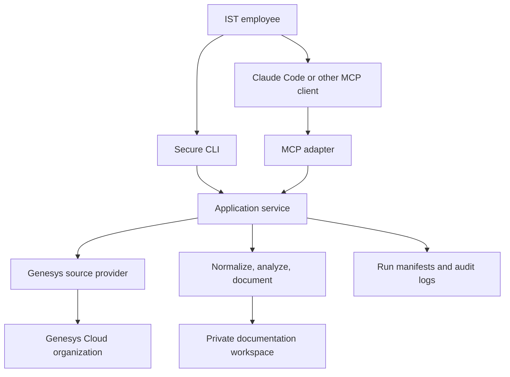
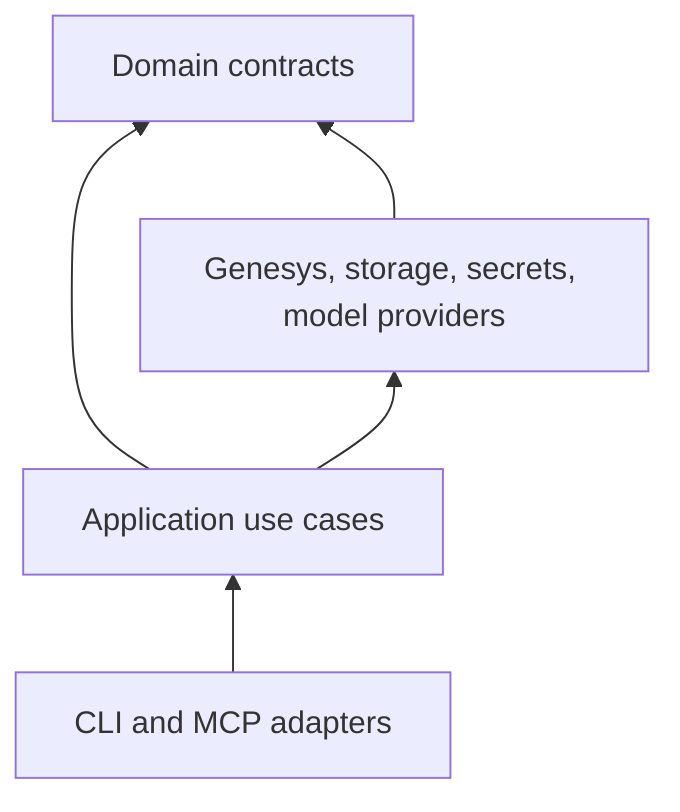
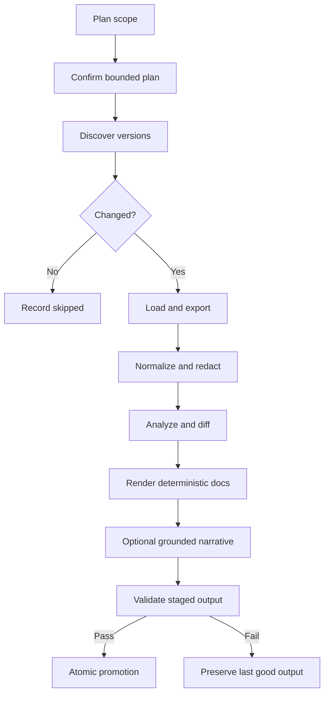

# 01 — System Architecture

## Architecture decision

Implement a modular TypeScript monorepo with a deterministic domain core. Ship the first release as a local CLI plus a local MCP STDIO server. Add a remote service only after an explicit security and operations decision.

## System context



## Why the core must not depend on MCP

MCP makes the workflow available to AI agents, but it does not provide scheduling, durable job state, source control, secret management, or guaranteed behavior across clients. A transport-independent application service allows:

- Direct unit and integration testing.
- CLI use when MCP is unavailable.
- Scheduled synchronization without an interactive chat.
- Reuse from a future web or remote MCP deployment.
- Stable behavior when MCP versions or clients change.

## Logical components

| Component                 | Responsibility                                                   | Must not do                                       |
| ------------------------- | ---------------------------------------------------------------- | ------------------------------------------------- |
| MCP adapter               | Validate tool inputs, invoke use cases, expose resources/prompts | Contain Genesys logic or secrets                  |
| CLI adapter               | Profile setup, diagnostics, planning, sync, export               | Duplicate application logic                       |
| Application service       | Orchestrate plans, runs, state transitions, and policies         | Depend on UI/client behavior                      |
| Genesys discovery adapter | Authenticate and enumerate flow metadata with pagination         | Export secrets or mutate tenant state             |
| Architect source adapter  | Load/traverse/export a specific flow version                     | Publish, save, check in, or unlock flows          |
| Normalizer                | Convert source objects into `FlowSnapshot`                       | Infer business meaning                            |
| Analyzer                  | Graph traversal, dependencies, paths, complexity, warnings       | Call an LLM                                       |
| Redactor                  | Remove secrets and classify sensitive values                     | Destroy evidence without recording redaction      |
| Document generator        | Render deterministic Markdown and evidence packs                 | Invent missing source facts                       |
| Narrative provider        | Optional evidence-bounded prose generation                       | Receive credentials or unredacted prohibited data |
| State store               | Manifests, caches, locks, snapshots, atomic promotion            | Be the credential store                           |
| Secret store              | Resolve a profile secret at runtime                              | Return secrets to MCP clients or logs             |

## Recommended repository layout

```text
apps/
  cli/
  mcp-server/
packages/
  application/
  domain/
  genesys-platform/
  genesys-architect/
  normalization/
  analysis/
  documentation/
  storage/
  security/
  observability/
  testing/
schemas/
fixtures/
docs/
```

Dependency direction:



The domain package must not import adapters, SDKs, filesystem APIs, or model-provider libraries.

## Main execution pipeline



## Runtime modes

### Mode A — Local STDIO, recommended first

- MCP client launches one process.
- Genesys credentials stay in a local approved secret store.
- Output is written to a local private workspace or cloned private repository.
- Lowest operational and tenant-isolation burden.
- Each AI client still requires its own one-time MCP registration.

### Mode B — Headless local/CI CLI

- Same core, no MCP dependency.
- Uses environment-to-secret-store references or CI workload identity.
- Produces deterministic docs and a proposed change set.
- AI narrative requires an approved provider or a later interactive review.

### Mode C — Remote Streamable HTTP, later

- Central hosting, corporate SSO, OAuth 2.1 for MCP access, tenant isolation, vault, database, object storage, rate limiting, and incident response are mandatory.
- It is not a shortcut around hosting/security. It is an operationally larger product.

## State and storage

The local release should use files as the source of truth:

- `.genesys-docs/state/runs/<runId>.json` — persisted job state.
- `.genesys-docs/cache/<orgId>/<flowId>/<hash>` — private, ignored snapshots.
- `docs/<orgSlug>/...` — reviewed documentation output.
- `.genesys-docs/locks/` — bounded single-writer locks.

Every write is staged under a run-specific directory, validated, then promoted by atomic rename where supported. A recovery journal handles platforms where directory replacement is not fully atomic.

## Concurrency model

- One active writer per organization/output root.
- Bounded extraction concurrency, initially two flows until rate behavior is measured.
- Independent organizations may run concurrently if their output roots and profiles differ.
- Cancellation leaves a resumable run manifest and removes only disposable staging files.

## Versioning

Version all public contracts independently:

- MCP server semantic version.
- MCP tool contract version.
- `FlowSnapshot.schemaVersion`.
- run manifest schema version.
- normalizer/analyzer/generator versions.
- documentation template version.

A documentation rebuild is required when a semantic generator change occurs even if a flow does not change. The manifest distinguishes `sourceChanged` from `generatorChanged`.

## Technology selection

- TypeScript with strict compiler settings.
- Official Model Context Protocol TypeScript SDK; do not implement JSON-RPC manually.
- Official Genesys Cloud Platform SDK and Architect Scripting SDK.
- Runtime schema validation for SDK responses and persisted files.
- Structured JSON logging with redaction.
- Markdown templates plus Mermaid for bounded diagrams.
- A current company-approved Node.js LTS selected and pinned after compatibility spikes.

Package names and exact versions are intentionally not frozen in this architecture document. The implementing agent must select versions that are mutually supported, pin them, and record the compatibility result.
