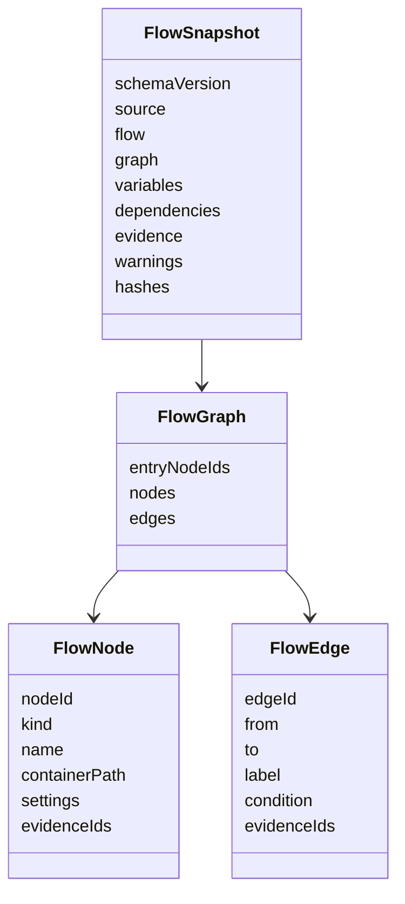

# 04 — Domain Model and Evidence

## Purpose

Genesys SDK objects and YAML shapes can change and differ across flow types. The product therefore normalizes every supported source into one versioned `FlowSnapshot`. Downstream analysis, diffs, documentation, tests, and MCP resources consume only this model.

The normative machine contract is `schemas/flow-snapshot.schema.json`.

## Aggregate structure

## Identity rules

- Organization identity: stable organization ID plus region.
- Flow identity: stable Genesys flow ID; names are display metadata only.
- Version identity: exact published/checked-in/working version selected by policy.
- Node identity preference: Genesys tracking ID, then stable source ID, then deterministic derived ID from canonical container path and node type.
- Dependency identity: resource type plus stable Genesys ID.
- Evidence identity: deterministic hash of snapshot version, source pointer, and field.

Derived IDs must remain stable when unrelated sibling ordering changes. Never use array index alone as identity.

## Source metadata

`source` records:

- Provider: Architect SDK, manual YAML, or fixture.
- Adapter and SDK versions.
- Extraction timestamp.
- Region and organization ID.
- Source version and publication state.
- Whether tracking IDs were available.
- Raw-source content hash after normalization and before redaction, stored only where approved.
- Redacted-source hash suitable for manifests.

No authentication material is part of source metadata.

## Flow metadata

`flow` contains stable ID, name, description, type, division, language settings, security marker, publication/version state, modified metadata when available, and source URL only if it is safe and approved.

The normalized model distinguishes:

- `publishedVersion`.
- `selectedVersion`.
- `latestCheckedInVersion` when visible.
- `workingCopyPresent` without loading it unless policy allows.

## Graph model

### Nodes

Every executable or structural item becomes a node:

- Flow entry and exit.
- Menus and menu choices.
- Tasks, reusable tasks, states, and containers.
- Actions such as audio, input collection, decisions, switches, loops, transfers, data actions, prompt operations, and disconnects.
- Explicit unsupported or opaque constructs.

Each node records:

- Stable identity and source/tracking ID.
- Normalized kind and original Genesys type.
- Human name.
- Container path.
- Sanitized settings.
- Variable reads/writes.
- Prompt and dependency references.
- Error/timeout behavior.
- Evidence IDs.
- Support level: `full`, `partial`, `opaque`, or `unsupported`.

### Edges

An edge represents possible control transfer. It records:

- Source and target node IDs.
- Normalized role such as success, failure, timeout, no-input, no-match, yes, no, case, loop, default, or transfer.
- Display label.
- Sanitized condition/expression.
- Ordering only where it affects execution semantics.
- Evidence IDs.

Dangling targets are preserved as graph warnings. They are not discarded.

### Cycles

IVRs legitimately contain retries and loops. Traversal algorithms must use visited state and strongly connected components rather than assuming a tree. Caller journeys are expressed as bounded path patterns with cycle annotations, not an infinite enumeration.

## Variables

Variables record scope, data type, name, direction, default or expression in sanitized form, secure marker, read locations, write locations, and evidence IDs.

Secure values are never materialized. A secure variable may be documented as existing and used at particular nodes without showing its value.

## Dependencies

Dependency categories include queue, prompt, schedule, schedule group, data action, integration, flow, reusable task, data table, script, user, group, skill, wrap-up code, and unknown.

Resolution states:

- `resolved` — stable ID and permitted display metadata obtained.
- `partially_resolved` — type/ID known but metadata unavailable.
- `not_found` — source references an object the resolver could not find.
- `forbidden` — permissions blocked resolution.
- `unsupported` — no resolver exists.
- `redacted` — resolution exists but policy withholds it.

Technical documentation must distinguish these states.

## Evidence model

Every evidence record contains:

- `evidenceId`.
- Source artifact identity and hash.
- Source pointer, tracking ID, or canonical object path.
- Field or relationship being asserted.
- A bounded sanitized excerpt or typed value.
- Classification and redaction status.

Generated statements reference one or more evidence IDs. Evidence is designed for review, not for reconstructing secrets.

## Findings and inference

Analyzer output separates:

- `fact`: directly represented by source evidence.
- `derived`: deterministic computation such as reachability or count.
- `inference`: interpretation such as probable business purpose.
- `unknown`: required information not present.

Every inference has a confidence level and review status. Business documents may use inferences; technical facts must be factual or deterministically derived.

## Canonicalization and hashing

The hash pipeline:

1. Validate source DTO.
2. Remove volatile extraction fields.
3. Sort maps and order-insensitive collections by stable identity.
4. Preserve semantically meaningful ordering.
5. Normalize line endings and Unicode.
6. Apply deterministic redaction tokens.
7. Serialize with a versioned canonical serializer.
8. Compute a cryptographic content hash.

Maintain separate hashes for:

- Source content.
- Normalized graph.
- Documentation evidence pack.
- Template/generator version.
- Final document.

A modified timestamp alone is not sufficient to establish semantic change.

## Completeness score

Compute a transparent completeness report, not a vague AI score:

- Percent of source executable objects represented.
- Unsupported and opaque node counts.
- Dangling edges.
- Unresolved dependencies by reason.
- Missing tracking IDs.
- Redacted fields.
- Traversal/reachability warnings.

Release policy determines which findings fail documentation and which permit `completed_with_warnings`.
