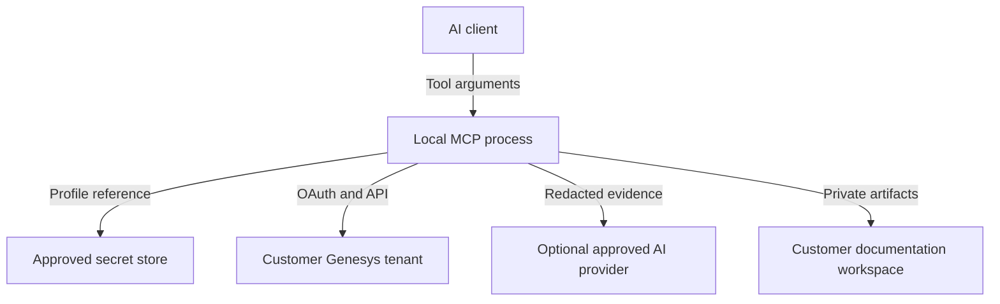

# 06 — Security and Compliance

## Security posture

This is a customer-configuration extraction tool. Even without caller data, IVR flows can reveal business processes, queue names, internal endpoints, authentication patterns, fraud controls, and failure behavior. Treat snapshots and generated documents as confidential customer material.

## Trust boundaries

The most important rule is separation: the AI client chooses a safe profile identifier; only the local process resolves the secret.

## Credential architecture

- `profile.json` stores non-secret metadata only.
- Client secrets are entered through a secure CLI prompt or provisioned by IT.
- Local production mode resolves them from an OS credential manager or approved enterprise vault.
- CI uses its secret system and injects only a reference or ephemeral value into the process.
- Environment variables are acceptable for controlled CI or development but never written to project files.
- Credentials are scoped per customer organization and rotated independently.
- Access tokens exist in memory only and are cleared at session end where runtime behavior permits.

Do not implement `profile add` as an MCP tool: tool arguments are chat-visible and may be logged by clients.

## Authorization model

### Local STDIO

The operating-system user boundary and Genesys OAuth permissions are primary. Additional controls:

- Profile allowlist in the tool configuration.
- Output-root allowlist.
- Maximum flow count per plan.
- Explicit broad-run confirmation.
- Per-profile audit log.
- Optional policy that disables AI narrative.

### Remote HTTP

Remote mode requires all of the following before release:

- Corporate SSO/OIDC and MCP-compatible OAuth 2.1.
- User-to-organization authorization mapping.
- Tenant-isolated secrets and storage.
- Role-based permissions for list, inspect, run, review, and administer.
- Per-user/service audit trails.
- Origin validation and secure transport.
- Rate limiting, WAF policy, incident response, backup, and deletion workflows.
- Data residency and customer contractual approval.

Without these, remote hosting is a rejected architecture.

## Threat model

| Threat                    | Attack/failure                                     | Required control                                                                |
| ------------------------- | -------------------------------------------------- | ------------------------------------------------------------------------------- |
| Secret disclosure in chat | User/model passes client secret to a tool          | No secret fields; CLI-only setup; schema rejection; log redaction               |
| Cross-tenant extraction   | Wrong profile or region selected                   | Discover and compare organization ID; plan shows tenant; profile binding        |
| Excessive permissions     | Convenience role grants edit/admin                 | Permission test; documented least-privilege role; adapter mutation denylist     |
| Prompt injection          | Flow text tells model to call tools or reveal data | Typed evidence packs; data delimiters; instruction hierarchy; output validation |
| Path traversal            | Flow name becomes output path                      | Slugify display names; path by stable IDs; canonical-root enforcement           |
| Symlink escape            | Output path points outside approved root           | Refuse unsafe links; secure open/create; post-resolution root check             |
| Log leakage               | SDK dumps headers or bodies                        | Central logger redaction; disable raw HTTP logging; secret canary tests         |
| Data exfiltration         | Unapproved AI provider receives customer config    | Deterministic default; provider allowlist; data classification gate             |
| Supply-chain compromise   | Malicious package reads credentials                | Lockfile, provenance, SBOM, scanning, minimal dependencies, release signing     |
| Stale or tampered output  | Old docs presented as current                      | Signed/hashed manifests, source version banner, freshness check                 |
| Destructive local write   | Broad path or wrong repository overwritten         | Plan preview, output allowlist, staging, atomic promotion, backup               |
| Denial of service         | Huge tenant/flow exhausts memory/context           | Pagination, streaming, size limits, bounded concurrency, resource output        |

## Input and output validation

- Validate every MCP and CLI input at runtime.
- Profile IDs are opaque IDs from configuration, not arbitrary paths.
- Region is an enum.
- Flow/version IDs match expected formats and must exist in the plan.
- Names are presentation only and never control access or paths.
- JSON/YAML parsers have size, alias, depth, and entity limits.
- Markdown and Mermaid escape tenant-controlled text.
- Output files are created only under a canonical approved root.

## Redaction policy

Redact or omit:

- Passwords, client secrets, tokens, authorization headers, cookies, and private keys.
- Secure variable values.
- Integration credential fields.
- Query-string credentials and sensitive URL parameters.
- Payload examples containing prohibited customer data.
- Values matching configured customer-specific patterns.

Redaction output is deterministic, such as `[REDACTED:authorization]`, so hashes and diffs remain stable. The manifest records counts and categories, not original values.

## Logs and audit

Application logs contain technical events. Audit records contain actor/process, profile ID, organization ID, selected flow IDs, operation, result, timestamps, correlation ID, output hashes, and policy decisions.

Neither contains credentials or raw source. Debug logging is disabled by default and cannot enable raw HTTP body logging in production.

## Customer isolation

- Separate output roots or repositories for different customers.
- Separate profiles and secrets.
- No cross-customer global search in the first release.
- Caches keyed by organization ID and flow ID.
- A run verifies that every cached snapshot belongs to the current organization.
- Copying artifacts between customer workspaces requires an explicit external process, not a tool feature.

## Retention and deletion

Policy must define retention for:

- Raw source/cache.
- Normalized snapshots.
- Generated documents.
- Run manifests.
- Audit logs.

Default recommendation: do not commit raw exports; encrypt private cache if retained; preserve approved documentation and manifests according to the customer engagement; provide a verified deletion command restricted to one profile/output root. Deletion is not exposed to the AI through MCP in the first release.

## Security tests required for release

- Secret canaries in every possible upstream field never appear in output/logs/errors.
- Prompt-injection strings do not alter tool selection, output paths, or narrative instructions.
- Traversal and symlink attacks fail.
- Tenant/profile mismatch stops before extraction.
- An OAuth role without mutation permissions completes the supported workflow.
- Static and dependency scans pass with no unapproved critical findings.
- Generated release artifact is reproducible or provenance-attested.
